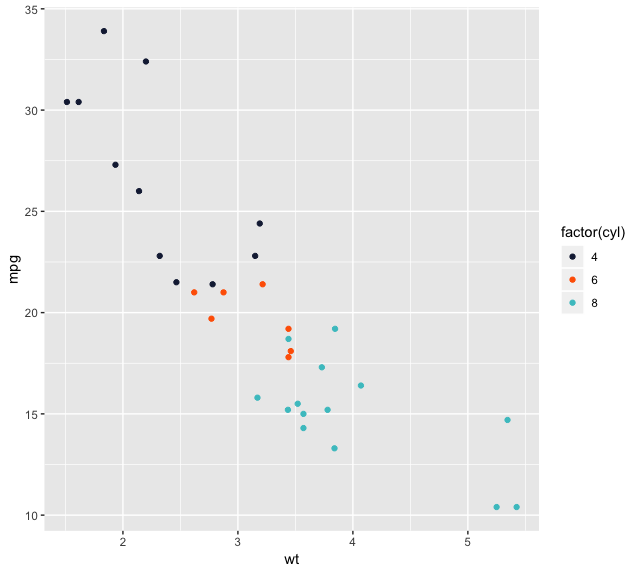

# Talkdesk ggthemes
**This is a fork of [ggthemes](https://github.com/jrnold/ggthemes) package with the Talkdesk palette. In the future,
the idea is to add a full Talkdesk theme.**

## About ggthemes

Some extra geoms, scales, and themes for [ggplot](http://ggplot2.org/).

See original repo for general instructions about the package.

## Install 

```r
devtools::install_github("quartin/ggthemes")
```

## Talkdesk palette usage

```r
library("ggplot2")
library("ggthemes")

ggplot(mtcars) +
  geom_point(aes(x = wt, y = mpg, colour = factor(cyl))) +
  scale_colour_talkdesk()
```


